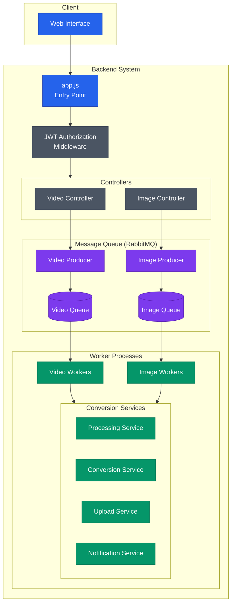

# Convert Quickly (backend)

**Convert Quickly** is a web application that allows users to upload media files, convert them to different formats, and download the converted files.

Check out [Convert Quickly (frontend)](https://github.com/Temidayo32/media-convert-client)

## Video Demo

## Convert Quickly Backend System Architecture

1. **Request Flow**: 
   - Requests enter through `app.js` as the main entry point
   - Pass through JWT authentication middleware
   - Authenticated requests are routed to specialized controllers based on content type (video/image)
   - Controllers handle the specific logic for each media type before queueing

2. **Queue Management**:
   - Controllers forward conversion tasks to their respective RabbitMQ producers
   - Video and image queues operate independently using a producer-consumer pattern

3. **Processing**: 
   - Dedicated workers consume from their respective queues
   - Video workers handle video-specific conversions
   - Image workers process image-specific conversions

4. **Services**: 
   - Core functionality is divided into processing, conversion, upload, and notification services
   - Both video and image workers utilize these shared services to complete conversions

The architecture ensures scalability and separation of concerns, with distinct routing, queueing, and processing pipelines for different media types.

## Features

- **Upload Media Files**: Users can upload video and audio files from their device, Dropbox, or Google Drive.
- **Convert Media Files**: The app supports converting videos and audio files to various formats.
- **Download Converted Files**: Users can download the converted files to their device.

## Technologies Used

- **Frontend**:
  - React.js
  - Tailwind CSS

- **Backend**:
  - Node.js
  - Express.js
  - FFmpeg (for video conversion)

- **Authentication**:
  - Firebase Authentication

## Roadmap

- **Video Converter**: Support for converting video files (e.g., MP4, MPEG) .
- **Image Converter (In Development)**: Support for converting raster and vector image files (e.g., JPG, PNG, SVG).
- **Document Converter (Coming soon)**: Support for converting document files (e.g., PDF, DOCX).
